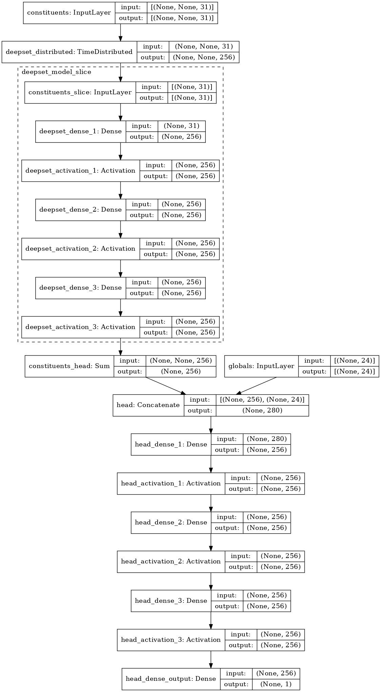
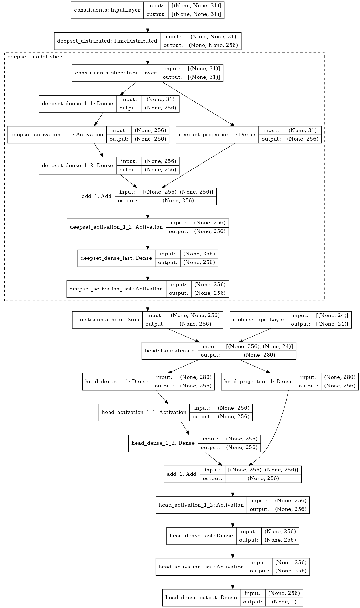
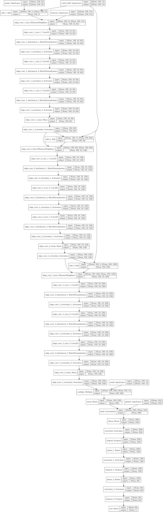

# jec-dnn

Jet Energy Corrections using DNN regression

## Model

The jet data is made up of variable-length unordered sets. To deal with this I use [Deep Sets](http://arxiv.org/abs/1703.06114) since the method has been used successfully before in [Energy Flow Networks](http://arxiv.org/abs/1810.05165) to discriminate quark jets from gluon jets.

In addition to that I experiment with [ParticleNet](https://arxiv.org/abs/1902.08570) which is based on [Dynamic Graph Convolutional Neural Network](https://arxiv.org/abs/1801.07829). This architecture is also suitable for variable length sets.

Example model structures from a few runs:

<details>
  <summary>Deep Sets MLP</summary>
  
</details>

<details>
  <summary>Deep Sets ResNet</summary>
  
</details>

<details>
  <summary>ParticleNet</summary>
  
</details>

## Environment

Build the Docker image (essentially the dependencies in `requirements.txt` on top of `tensorflow/tensorflow:latest-gpu`).

```bash
docker build . -t jec-dnn
```

Enter a container with the current directory mounted using your user privileges.

```bash
./run_docker.sh
```

Re-enter stopped container

```bash
docker start -i <container id>
```

### Training

To train once you can edit `config.yaml` to your liking and then run something like:

```
python train.py -i data/test -o results/test-run -c config.yaml --gpus 1 3
```

Train using multiple configuration files:

```
nohup ./run_configs.sh -o results/resnet -c configs/resnet -d data/test -g 0 > resnet.txt
```

### Plot results

E.g.

```
python plot.py -i results/resnet -o figs/resnet
```
