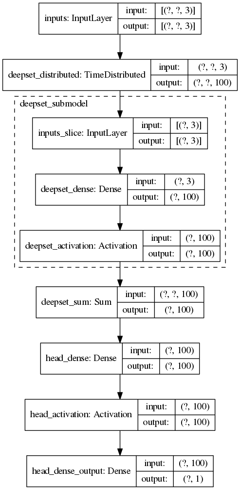

# jec-dnn
Jet Energy Corrections using DNN regression

## Model

The jet data is made up of variable-length unordered sets. To deal with this I use [Deep Sets](http://arxiv.org/abs/1703.06114) since the method has been used successfully before in [Energy Flow Networks](http://arxiv.org/abs/1810.05165) to discriminate quark jets from gluon jets.

